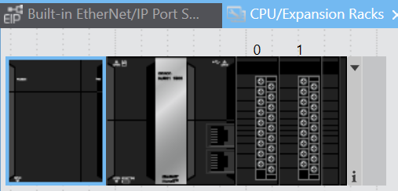
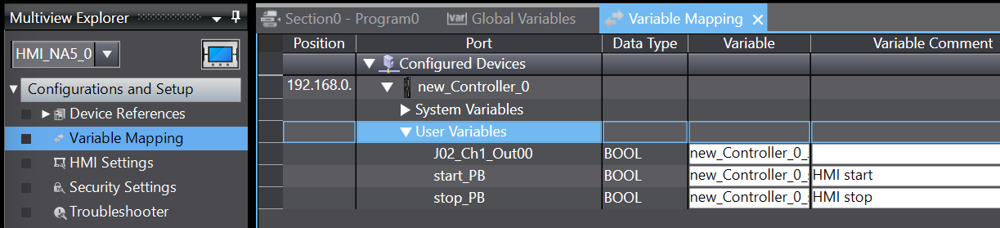

# Lab 1: Introduction to Omron PLC & HMI

## 1. Objectives
By the end of this lab, students will:
- Understand how to establish network communication between **Omron NJ301 PLC**, **NA5 HMI**, and **PC**.
- Create a new **Sysmac Studio** project for the Omron PLC.
- Define **variables** for inputs, outputs, and internal logic.
- Develop a basic **ladder logic program** for **START and STOP** operation.
- Design an **HMI interface** with buttons and indicators.
- Implement a **sequential pump start operation** with timers.

---

## 2. Equipment & Software Required
- **Omron NJ301-1100 PLC**
- **Omron NA5 HMI**
- **PC with Sysmac Studio Installed**
- **Ethernet Switch & Cables**

---

## 3. PLC & HMI Network Setup

### 3.1. IP Address Configuration
Step A: LOGGING (LAUNCHING) IN SYSMAC STUDIO  
The application can be found in the OMRON folder from the start menu, as illustrated in Figure 2:  

  

  
Step B: CREATING A NEW PROJECT  
Enter the project name, author, and comment in the Project Dialog Box. Choose Nj301-1100 and 1.20 version as shown below. And create

  

  
Step C: SYSTEM CONFIGURATION, COMMUNICATIONS and ETHERNET SETUP
There is one PLC created in the **Multiview Explorer** with two main sections:  

- **Configurations and Setup**: Used to define the CPU, configure input and output modules, and set the IP address.  
- **Programming**: Used for writing and organizing ladder logic programs for the PLC.  

  

   

Expand the **Configuration and Setup** menu by navigating to:  
**Configuration and Setup → Controller Setup → Built-in Ethernet/IP Port Settings**.  

1. Select the **TCP/IP** tab.  
2. Enter the PLC’s IP address.  
3. In this lab, the PLC is already set to **192.168.0.1** and Subnet Mask: **255.255.255.0**
4. You need to configure this IP address in the IDE to ensure it can detect the PLC on the network.  

Step E: TEST THE COMMUNICATION   
Select the Communications Setup function from the top menu (Controller → Communications Setup…).

  

  

Then, specify the remote IP address in the blank field. Populate the IP address field with the IP address that has been labelled on the PLC located on your bench. It should appear in the form: 192.168.0.1. 

Click on Ethernet Communications Test. You should get the following message: Test OK  

  

  

If you reach here, your Sysmac Studio is able communicate with the PLC. Before, you can start programming you need to obtain the configuration of the PLC through the LAN connection.

Step E: RACK CONFIGURATION  
Click the **Go Online** Button in the toolbar.

  

   

The button next to the **Online** button is the **Offline** button. Now, you try to go online and then offline. You go online if you want to transfer program to the controller and debug the programs. You go offline if you are doing the coding/programming.  

Double-click **CPU/Expansion Racks** under *Configurations and Setup** in the Multiview Explore.  

Right-click anywhere in the Unit Editor where there is no Unit and select **Compare and Merge with Actual Unit Configuration**.

The actual Unit configuration is read and compared with the Unit configuration on the Sysmac Studio. This results are displayed in the Actual Unit Configuration Compare and Merge Window.  
Click the **Apply actual Unit configuration** Button to synchronize witht he actual configuretion.
Click the **OK** Button. This returns you the Unit Editor

  

 

    

  

 

---

## 4. Creating a New PLC Project in Sysmac Studio

We will create a simple program that consists of two push buttons: **Start** and **Stop**.  
- When the **Start** button is pressed, the pump starts running.  
- At any time, when the **Stop** button is pressed, the pump will stop.  
- The **Start** and **Stop** buttons will be implemented in the HMI.  
- You can also implement them using physical switches once the HMI configuration is complete.

### Steps:
4.1. **Define Variables**  
   - Create an **output variable** for the pump.  
   - Create two **Boolean variables**: `Start` and `Stop`.  

4.2. **Create the Ladder Logic**  
   - Implement logic to control the pump based on the **Start** and **Stop** buttons.  

4.3. **Design the HMI**  
   - Add a **Start** button, a **Stop** button, and a **light indicator** to show whether the pump is running.  
   
Once the setup is complete, you can test the functionality using the HMI.  

### 4.1 Defining Variables

The CPU must be in **offline mode** during the programming stage.  
If you are in **online mode**, toggle to **offline mode** before proceeding.  

1. In **Configuration and Setup**, double-click **I/O Map**.  
2. Select **Ch1_Out00**, right-click, and choose **Create Device Variable** from the menu.  

  

  

### Creating Start and Stop Boolean Variables

1. Expand **Programming** in the **Multiview Explorer**.  
2. Double-click **Global Variables** to open the **Global Variables** table.  
3. Right-click and select **New Variable** to insert the `Start` and `Stop` variables as shown below:  

  

  

### 4.2 Creating the Ladder Logic  

1. Expand the **Programming** section in the left-hand menu:  
   **Programming → POUs → Programs → Program0 → Section0**  

  

      

#### Adding Inputs to the Ladder Diagram  

**Method 1:**  
- Select **Input** from the **Ladder Tools** in the Toolbox.  
- Drag it to the desired location in the **Ladder Editor**.  

  

  

**Method 2:**  
- Right-click on an empty rung.  
- In the pop-up menu, select **Insert Input (C)**.  

  

  

#### Constructing the Ladder Diagram  

- Create a ladder diagram similar to the one shown below.  
- Right-click on **start_PB** and select **Insert Parallel Input Below** to insert **J02_Ch1_Out00** underneath.  

  

  

---

## 5. Creating HMI Interface     
Follow these steps to add a HMI panel to the project:  

1. Select **Communications Setup...** from the top menu:  
   **HMI → Communications Setup...**  

2. First, verify whether the HMI is using the default IP address (**192.168.0.2**) by testing the connection in Sysmac Studio.  

  

  

3. If the IP address is incorrect or needs to be changed, configure the HMI's IP settings in Sysmac Studio to match the required network configuration.  

  

    

  

  

Select NA5-9W001□ and any version, and click the OK button.  

  

 

#### 5.1 TEST THE COMMUNICATION
Like PLC, the ip address also need to be configured. The default ip address of the HMI is 192.168.0.2. The Sysmac studio need to configure so that it is able to connect to the HMI for download the program. 

Go to **HMI** on the top menu, 

**Mapping HMI Variables and Controller Variables**
1. Double-click **Variable Mapping** under **Configuration and Setup** in the Multiview Explorer.
2. Right-click **User Variables** under **new_Controller_0** and select **Create Device Variabe** from the menu.  
The Controller global variable ar automatically mappedt the the HMI globa variable

  

  

**HMI Design**
Double-click Page0 under HMI Pages in the Multiview Explorer.  Drag and drop the Momentary Button from the Toolbox into the page.  

  

 
For Start_PB :  

  

 

For Stop_PB: 

  

 

For the indicator:

  

 

Go online by clicking   in the  Toolbar.  
Click   in the Toolbar.
Click the **Transfer to Device** Button.

  

 

When the transfer is completed, the HMI is restarted automatically.

## 6. Testing & Final Exercise

### Exercise: Sequential Pump Start with Timers

**Task:** Modify your program so that:
- Pressing `Start_PB` starts `Pump1`.
- `Pump2` starts **5 seconds** later.
- `Pump3` starts **5 seconds after Pump2**.
- Pressing `Stop_PB` **immediately stops all pumps**.

✅ **Test your implementation and verify the sequence works as expected.**

---

## 7. Conclusion

By completing this lab, students have:
- Set up **network communication** between Omron PLC, HMI, and PC.
- Created a **ladder logic program** with **timers**.
- Designed an **HMI interface** for control.
- Implemented **sequential pump control** with timed delays.
