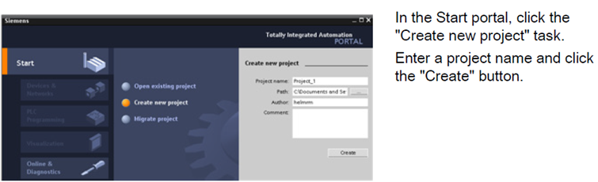

# CURTIN MIRI  

## INDUSTRIAL AUTOMATED SYSTEMS 402  

# LABORATORY 1: Introduction to PLC  

## Objectives  
1. Demonstrate the setup of the PLC in Miri.  
2. Create and configure a template project in TIA Portal.  
3. Explain the functionality of START and STOP pushbuttons.  
4. Understand sequence control using a timer.  

---

## Introduction to PLC  

### What is TIA Portal?  

**TIA Portal (Totally Integrated Automation Portal)** is a software platform for programming and managing Siemens automation devices.  

#### Key Features:
- **Integrated system:** Combines PLCs, HMIs, drives, and more into a single platform.  
- **Efficient engineering:** Simplifies configuration, programming, testing, and diagnostics, reducing development time.  
- **User-friendly interface:** Provides a unified workspace for automation tasks.  

---

## Getting Started with TIA Portal: "Hello World" Example  

This section guides you through creating a basic project in TIA Portal. By the end, you will:
- Create a new project file.  
- Develop ladder logic to control an LED based on an input switch.  

### Configuring the PLC  

  

1. Open TIA Portal and select **"Configure a device."**  

     

2. Choose the appropriate PLC model and add it to the project.  

     

3. Proceed with hardware configuration and initial setup.  

     

---

  

Choose PN/IE as the type of PG/PC interface and on PG/PC interface select the network adapter that you are using to connect to the PLC.

Click Start search. When scanning completes, select the PLC from the list of compatible devices. Next, click on Detect.

